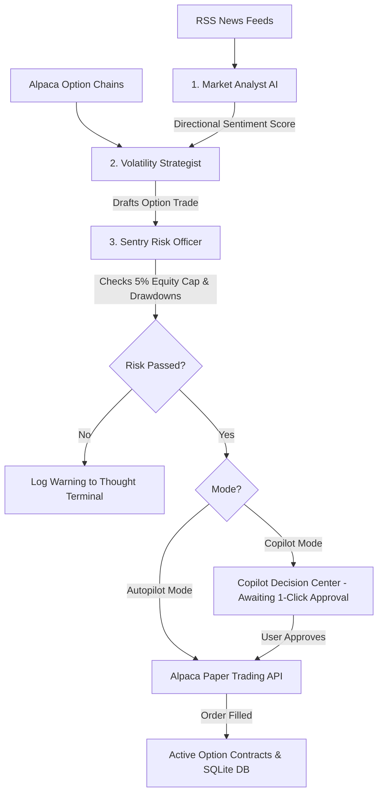

# 🛡️ SentryTheta AI — Autonomous Options Risk & Strategy Platform

> **Built for the Alpaca AI Trading Agents Hackathon**  
> *An institutional-grade, multi-agent options trading desk with deterministic risk guardrails, real-time news sentiment analysis, and a glassmorphic human-in-the-loop dashboard.*

---

## 🌟 Overview

**SentryTheta AI** bridges the gap between LLM reasoning and mathematical risk controls in financial markets. Rather than allowing generative models to directly submit raw financial transactions, SentryTheta employs a **Multi-Agent Orchestration Layer** supervised by a **Deterministic Risk Engine** (Sentry Risk) and real-time execution via Alpaca's Paper Trading API.

Whether operating in **Copilot Mode** (human-in-the-loop 1-click approvals) or **Autopilot Mode** (100% autonomous execution), SentryTheta enforces strict position limits, drawdown circuit breakers, automated stop-loss, and take-profit harvests.

---

## 🚀 Key Features

- 🧠 **Multi-Agent Decision System (`backend/agent.py`):**
  - **Market Analyst:** Continuously monitors Yahoo Finance RSS feeds and evaluates news sentiment via Google Gemini 1.5/2.0 Flash (with deterministic NLP fallbacks).
  - **Volatility Strategist:** Queries live option chains from Alpaca, identifies near-the-money opportunities, and designs option strategies (*Long Calls, Long Puts, Cash-Secured Puts*).
  - **Sentry Risk Officer:** Deterministically checks capital allocations, margin limits, and daily account drawdowns.
  - **Trade Executor:** Dispatches verified orders directly to Alpaca or stages them in the Copilot queue.

- 🛡️ **Deterministic Risk Management (`backend/risk_engine.py`):**
  - **Position Sizing Caps:** Ensures individual option positions do not exceed customizable percentages of total equity (e.g. 5%).
  - **Max Daily Drawdown:** Protects capital by halting all automated scanning if daily losses breach predefined limits (e.g. 3%).
  - **Automated Exit Triggers:** Constantly monitors active positions to execute automated Stop-Loss (-15%) and Take-Profit (+30%) liquidations.

- 📊 **Real-Time Glassmorphic Dashboard (`frontend/`):**
  - **AI Thought Terminal:** Streams live agent reasoning and system actions with sub-agent color coding.
  - **Copilot Decision Center:** Real-time trade review cards with dynamic sentiment meters and risk clearance reports.
  - **Searchable Tickers Registry:** Dynamic tag-input dropdown with **6,100+ option-eligible assets** cached from Alpaca.
  - **Guided Workflow Stepper:** Step-by-step onboarding checklist and matching visual badges for intuitive navigation.
  - **Full Mobile Responsiveness:** Clean vertical stacking, touch-friendly interactions, and horizontal scroll tables on mobile/tablet screens.

- 💾 **SQLite Persistence Layer (`backend/db_helper.py`):**
  - All system settings, risk limits, portfolio states, and historical terminal logs persist across server reboots via `sentrytheta.db`.

- 🔌 **Model Context Protocol (MCP) Integration (`mcp_server.py`):**
  - Implements an MCP-compliant JSON-RPC server enabling external LLM tools (Claude Desktop, Cursor, Custom Agents) to query portfolio health and trigger option scans.

---

## 🏗️ System Architecture



---

## ⚡ Quick Start

### 1. Clone & Install Dependencies
```bash
git clone https://github.com/your-username/SentryTheta-AI.git
cd SentryTheta-AI
pip install -r requirements.txt
```

### 2. Configure Environment (`.env`)
Copy the template and add your credentials:
```env
# Alpaca Paper Trading Credentials
ALPACA_API_KEY=your_alpaca_key_id
ALPACA_SECRET_KEY=your_alpaca_secret_key
ALPACA_PAPER=true

# Google Gemini API (Free Tier from Google AI Studio)
GEMINI_API_KEY=your_gemini_api_key

# Trading Configuration
TARGET_TICKERS=AAPL,MSFT,NVDA,SPY,QQQ
TRADING_MODE=copilot # copilot or autopilot
SCAN_INTERVAL_SECONDS=60
```

### 3. Launch Dashboard & Server
```bash
python main.py run-server
```
Visit **`http://localhost:8000`** in your browser.

---

## 🧪 CLI Commands

Test and interact with the platform directly from the terminal:

* **Dry-Run API Test:**
  ```bash
  python main.py test-trading --mock
  ```
* **Run Single Agent Scanner Cycle:**
  ```bash
  python main.py run-agent --ticker NVDA
  ```
* **Start Model Context Protocol (MCP) Server:**
  ```bash
  python main.py run-mcp
  ```

---

## 🏆 Hackathon Alignment

| Criteria | SentryTheta Implementation |
| :--- | :--- |
| **Agent Autonomy** | Multi-agent hierarchy analyzing news sentiment, designing option spreads, and self-executing on Autopilot. |
| **Alpaca Integration** | Real-time option contracts lookups, account metrics streaming, and live paper order fills via `alpaca-py`. |
| **Risk Guardrails** | Deterministic mathematical risk engine overriding LLM hallucinations to protect account equity. |
| **User Experience** | Glassmorphic, responsive web interface with real-time WebSockets, live stepper checklists, and 1-click approvals. |
| **Extensibility** | MCP server integration and SQLite persistence for stateful, long-term operation. |

---

## 📄 License
This project is licensed under the MIT License.
